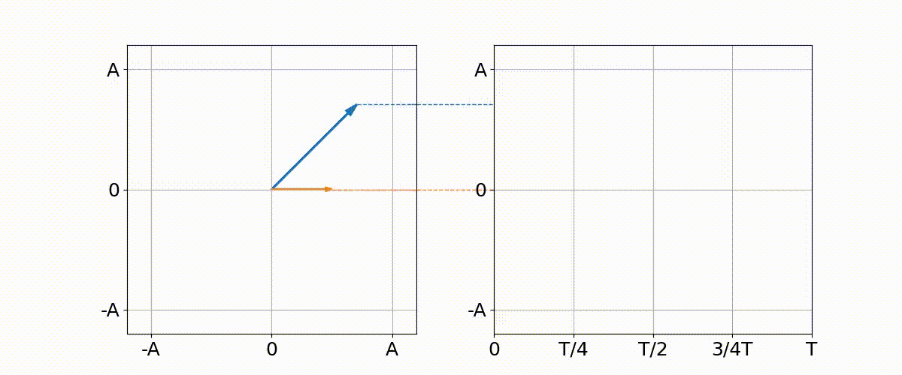

# Some script useful for teaching basic circuit theory

This repository is a collection of python scripts and jupyter notebooks useful to study specific aspects of basic circuit theory.

## 1. Video about symbolic method

All videos can be found in the video folder at this [link](https://github.com/giaccone/pytool4teaching/tree/main/video). In the following, you can find them embedded in this page with a description of the python code that makes possible to generate them.

### 1.1 Link between sine wave and phasor

The script `1_symbolic_method_1pha.py` makes it possible to produce a video showing the link between a sine wave and its associated phasor as shown below:

  

### 1.2 Two phasors at the same time (same or different frequency)

The script `2_symbolic_method_2pha.py` makes it possible to produce a video showing two sine wave with either equal or different frequency as shown below:

  

  

### 1.3 Sum of two phasors (same or different frequency)

The script `3_symbolic_method_2pha_sum.py` makes it possible to produce a video showing the sum of two sine wave with either equal or different frequency as shown below:

  

  

## 2. Jupyter notebook

### 2.1 Power in AC systems

The jupyter notebook `ac_power.ipynb` makes it possible to show the power in alternating current systems. It is possible to show the waveforms for different nature of loads.

  

### 2.2 power factor correction

The jupyter notebook `power_factor_correction.ipynb` makes it possible to study the phasor diagram related to the power factor correction. It is possible to show the effect of e wrong design by increasing the reactive power associated to the capacitor up to unreasonable values (i.e. the current leads the voltage).

  

### 2.3 Power in three phase systems

The jupyter notebook `three_phase_system_power.ipynb` makes it possible to study the instantaneous power in three phase systems. It is possible to show that in symmetric and balanced conditions, the total instantaneous power is constant.

  

### 2.4 Low pass filter

The jupyter notebook `low_pass_filter.ipynb` makes it possible to apply a simple low pass filter to sine wave with a superimposed high frequency noise. It is possible to study the effectiveness of the filter by varying the cut-off frequency**

  

### 2.5 Filter a noisy sound

The jupyter notebook `filter_sound.ipynb` makes it possible to generate a sound (you can hear it) and superpose a a noise to it. Afterward, a filter is generated to remove (as much as possible) the noise. All sounds can be reproduced using the notebook.

  

